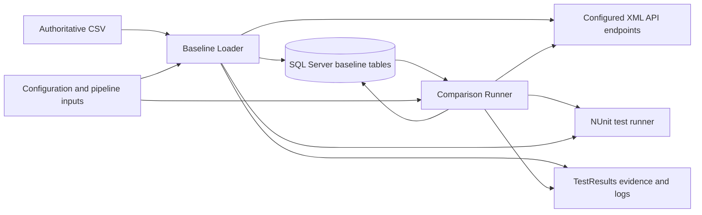
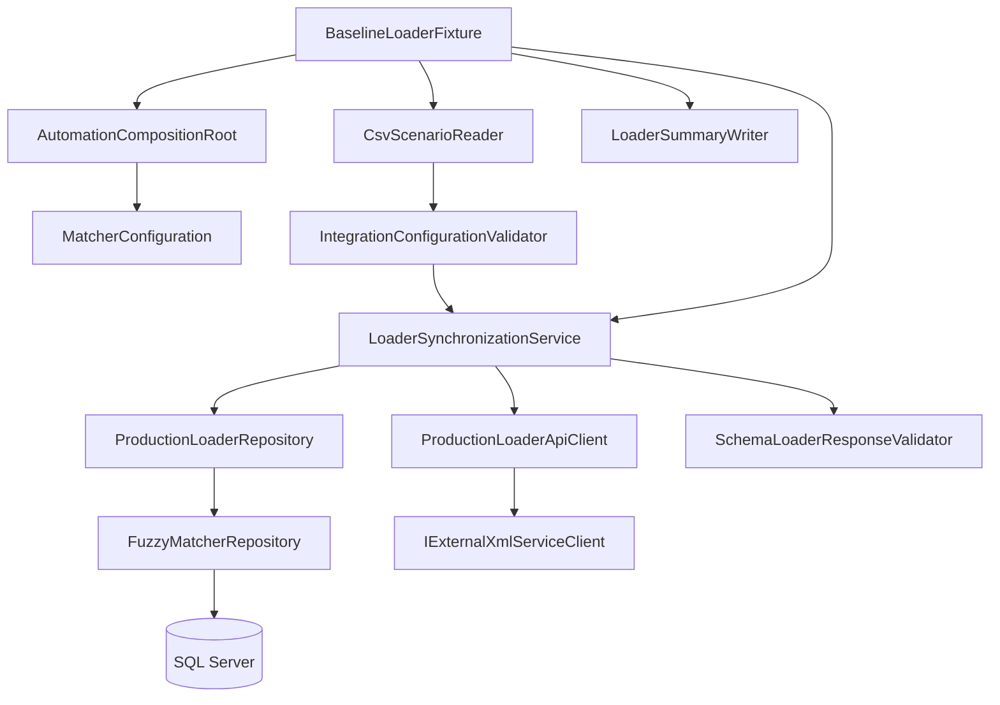
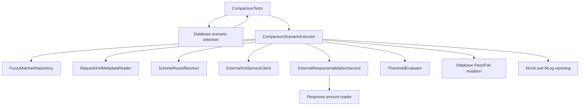

# FuzzyPricingMatcher Architecture

## Document Purpose

This document describes the current architecture of FuzzyPricingMatcher for an external architect review. It explains the existing design, runtime boundaries, data ownership, safety controls, and areas where architectural recommendations may be useful.

This is a test and integration automation solution, not a general-purpose production service.

## Executive Summary

FuzzyPricingMatcher is a .NET 10 NUnit test project containing two connected workflows:

1. **Baseline Loader**: reads authoritative scenario data from CSV, calls configured XML APIs for new or changed scenarios, validates responses, and synchronizes SQL Server baseline rows.
2. **Comparison Test Runner**: discovers selected scenarios from SQL Server, sends stored request XML to the configured API, validates current and stored responses, compares extracted amounts against thresholds, persists Pass/Fail, and reports evidence through NUnit and NLog.

The solution is configuration-driven and intentionally guarded. Live API and SQL execution is disabled by default. Placeholder endpoints, routes, schemas, credentials, and connection strings are rejected before integration work can begin.

## Architectural Context



## Solution Shape

The solution currently contains one .NET test project:

```text
FuzzyPricingMatcher.sln
└── src/FuzzyPricingMatcher.Tests/
    ├── ExternalAPIAccess/       (client, retry, rate limiting, URL building, Models.cs)
    ├── Comparison/              (Enums/, Models.cs, scenario executor)
    ├── Configuration/           (Enums/, settings sections)
    ├── Database/                (repository, mutation executor, Models.cs)
    ├── Evidence/                (safe file names, path building, evidence writers)
    ├── Infrastructure/          (composition root, safe logging)
    ├── Loader/                  (Enums/, Models.cs, synchronization service)
    ├── Processing/              (CSV reading, normalizers, fingerprinting)
    ├── Routing/
    ├── Schemas/
    ├── Validation/
    └── Tests/
        └── Unit/
```

Models are one `Models.cs` file per folder (record/DTO types are colocated rather than one file per type); enums keep their own `Enums/` subfolder where a folder has more than one. `Tests/Integration` does not exist yet — guarded integration entry points are still on the [project TODO](project-todo.md).

The project contains both test entry points and production-style support services. This is appropriate for the current automation harness, but an architect may wish to assess whether the infrastructure should eventually move into a separate class library if reuse or deployment boundaries grow.

## Layer Responsibilities

### Test entry points

Currently all under `Tests/Unit` (guarded `Tests/Integration` entry points are not yet implemented).

Responsibilities:

- define NUnit categories and test cases
- load the composition root
- pass resolved run inputs into workflows
- make final NUnit assertions

Tests should not contain SQL construction, RestSharp configuration, XML schema logic, or baseline synchronization rules.

### Infrastructure

Centered on `AutomationCompositionRoot`.

Responsibilities:

- load configuration
- validate global settings
- register interfaces and implementations
- construct the dependency graph
- dispose owned services
- expose guarded integration execution

### Configuration

Centered on `MatcherConfiguration` and its section classes.

Configuration sections currently represent:

- automation thresholds and tag matching mode
- database settings
- pipeline run context
- loader settings
- evidence settings
- resilience settings
- endpoint settings
- route settings

Configuration sources are loaded in this order:

```text
appsettings.json
    -> optional appsettings.Local.json
    -> environment variables
    -> strongly typed configuration objects
    -> global and integration validation
```

Environment variables use the standard double-underscore hierarchy, for example:

```text
Pipeline__ApiDate
Pipeline__RequestedTestTags
Automation__MinimumThreshold
Automation__MaximumThreshold
Automation__TagMatchMode
```

### Processing

Responsibilities:

- read CSV scenarios
- normalize scenario IDs and tags
- parse request XML metadata
- compute request fingerprints
- detect duplicate scenario IDs
- compare current and existing request state
- select response amount readers

The processing layer transforms raw input into objects that loader and comparison workflows can use.

### Routing

`SchemeRouteResolver` maps a `SchemeCode` to endpoint and route configuration.

It prevents workflow code from needing to know which API endpoint handles a particular scheme.

### ExternalAPIAccess

Responsibilities:

- validate API request configuration
- resolve endpoint resource paths and dates
- create authenticated RestSharp clients
- construct XML `POST` requests
- apply rate limiting
- retry transient failures
- return raw transport results

The API layer does not interpret response business values and does not make threshold decisions.

### Database

Responsibilities:

- create SQL Server connections
- execute Dapper queries
- map rows to typed database models
- create parameterized mutation plans
- execute transactional mutations
- retry transient database operations
- enforce duplicate-row consistency rules

### Validation

Responsibilities:

- safely register local XSD files
- compile schemas
- validate XML documents
- validate loader responses
- provide validated documents to amount readers

### Loader

Responsibilities:

- compare authoritative CSV scenarios with SQL baselines
- decide whether a scenario is new, unchanged, tag-only changed, or XML changed
- call the API only when required
- validate new API responses before persistence
- defer obsolete deletion until the run is clean
- produce loader summaries and failure evidence

### Comparison

Responsibilities:

- execute one selected comparison scenario
- obtain stored request and response baselines
- call the current API
- validate both current and baseline XML
- extract comparable amounts
- evaluate inclusive thresholds
- persist Pass/Fail before final reporting

### Evidence

Responsibilities:

- build safe evidence paths
- group artifacts by build and scenario
- save request, baseline, API response, and error files
- attach files to NUnit

## Composition Root

`AutomationCompositionRoot.Create` is the system composition root.

It registers:

```text
Configuration
    -> MatcherConfiguration and section settings
Processing
    -> CSV reader, normalizers, metadata, fingerprints
Routing
    -> SchemeRouteResolver
Data
    -> connection, mutation, retry, repository
API
    -> client factory, resource builder, limiter, retry pipeline, XML client
Validation
    -> schema registry, schema validator, amount reader registry
Workflow
    -> loader and comparison executors
Evidence and reporting
    -> evidence writers, summary writer, logger, NUnit output
```

Most infrastructure services are registered as singletons. Workflow executors are transient. The service provider is built with validation enabled so missing or invalid registrations fail during composition rather than during a later test step.

## Core Data Contracts

### Prepared baseline scenario

The CSV processing flow produces `PreparedBaselineScenario`:

```text
BaselineScenarioCsvRow
    -> normalized scenario ID
    -> RequestXmlMetadata
    -> normalized tags
    -> XML fingerprint
    -> PreparedBaselineScenario
```

This object is prepared for loader synchronization. It is not a reporting model.

### ExternalAPIAccess request

`ExternalXmlRequest` contains:

- scenario ID
- SchemeCode
- raw XML
- build ID
- endpoint settings
- route settings
- API date

The policy reference is not a separate API metadata field. It remains inside the raw XML body as `PolicyReference`. The value may be extracted and represented as `QuoteRef` for internal reporting, evidence, database references, and test naming.

### Database models

Database read models represent request rows, response rows, snapshots, duplicate results, and scenario selections. Mutation command models represent inserts, updates, tag updates, Pass updates, and Fail updates.

The database repository keeps SQL details out of loader and comparison orchestration.

## Baseline Loader Architecture



The loader protects existing data by postponing obsolete deletion until every current input record succeeds.

## Comparison Architecture



Scenario selection is database-first. `TagMatchMode.Any` selects scenarios containing at least one requested tag. `TagMatchMode.All` selects scenarios containing every requested tag. NUnit creates and runs only the scenarios returned by the repository.

## API Architecture

```text
ExternalXmlRequest
    -> ExternalXmlServiceClient.ValidateRequest
    -> ExternalAPIRequestUrlBuilder.BuildRequestUri
    -> ExternalServiceClientFactory.GetClient
    -> ExternalAPIRetryPolicy.ExecuteAsync
        -> ExternalAPIRateLimiter.WaitAsync
        -> create RestRequest
        -> RestRequestExecutor.ExecuteAsync
        -> convert RestResponse to ExternalAPIResponse
    -> loader or comparison caller
```

`ExternalServiceClientFactory` maintains a thread-safe, on-demand cache of one authenticated RestSharp client per endpoint name.

The API client sends the exact raw XML string. It does not add a correlation header or send `QuoteRef` separately. The policy reference is exposed to the API only as part of the XML request body.

## Database Architecture

```text
Repository operation
    -> DatabaseRetryExecutor
    -> SqlConnectionFactory
    -> SqlConnection.OpenAsync
    -> Dapper QueryAsync<T> or mutation executor
    -> typed model / transaction result
    -> repository consistency checks
    -> workflow decision
```

SQL values use parameters. Configured table identifiers are validated before being inserted into SQL text because SQL identifiers cannot be normal value parameters.

## Resilience

API and SQL resilience are intentionally separate.

API:

- process-wide request spacing
- retry of transport failures
- retry of HTTP 408, 429, 502, 503, and 504
- exponential delay and jitter
- support for `Retry-After`

SQL:

- retry of recognized transient SQL errors
- exponential delay and jitter
- cancellation-aware delays

Neither pipeline retries logical configuration errors, malformed input, validation failures, threshold failures, or caller cancellation.

## Security And Safety Controls

Current controls include:

- integration execution requires `FUZZY_RUN_INTEGRATION=true`
- placeholder hosts are rejected
- disabled endpoints and routes are rejected
- missing credentials are rejected
- missing XSD files are rejected
- placeholder response processors are rejected
- DTD processing is prohibited for request and response XML
- external XML/schema resolution is restricted
- SQL identifiers are validated
- SQL values are parameterized
- evidence paths are contained under the configured root
- file names are sanitized
- credentials and connection strings are expected to remain in private configuration

## Current Limitations

- Live endpoint contracts and SchemeCode mappings require approval.
- Real credentials and SQL permissions are not committed or verified.
- The committed CSV is a safe template.
- Live SQL/API integrations have not been run in the normal local verification path.
- Coverage is collected, but no percentage gate is enforced.
- The current project combines test entry points and reusable infrastructure in one test assembly.
- Some workflow boundaries synchronously wait on asynchronous repository/API calls; an architect may wish to assess whether the public workflow should become fully asynchronous.
- The `ExternalXmlServiceClient` contains a `timeoutSeconds` field, but the current implementation should be reviewed to confirm that the configured timeout is applied to the RestSharp client or request.

## Architect Review Questions

The following are intentional review topics, not declared defects:

1. Should reusable API, database, validation, and workflow infrastructure move into a production-style class library separate from NUnit fixtures?
2. Should loader and comparison workflow methods become fully asynchronous instead of using `.GetAwaiter().GetResult()`?
3. Should `QuoteRef` be renamed consistently to `PolicyReference` internally, with a reporting projection if `QuoteRef` is the team's preferred report term?
4. Should API timeout configuration be wired directly into `RestClientOptions` or `RestRequest`?
5. Is the retry policy appropriate for every configured `POST` endpoint, or should idempotency/retry safety be configured per route?
6. Should response amount readers be implemented as a more explicit strategy contract with route-level validation?
7. Should SQL table names remain configuration-driven, or should approved table mappings be constrained more strongly?
8. Should `TagMatchMode` and tag filtering remain in repository SQL, or should a database view/stored procedure be considered for the fixed schema?
9. Should evidence retention and redaction rules be defined for production-like XML data?

Resolved: one class per public type is *not* the standard layout. An interface is kept only where it backs a real test seam (a fake substitutes for it) or has more than one production implementation — the repository, route resolver, external API client, rate limiter, clock, evidence writers, logger, response amount reader, and SQL mutation session/transaction all qualify. Pure-function helpers (normalizers, readers, the schema registry/validator, the retry policy/URL builder/client factory, the threshold evaluator, and the loader/comparison/CSV entry points) had exactly one production implementation and no substitution, so their interfaces were removed in favor of the concrete class; likewise, small record/DTO types are colocated in one `Models.cs` per folder instead of one file per type. See the [project TODO](project-todo.md#completed-work) for the full list of what changed.

## Verification Status

The local unit suite currently passes:

```text
86 succeeded
0 failed
0 skipped
```

The unit suite uses fakes and does not require live SQL or API access. Integration execution requires separately approved infrastructure and configuration.
