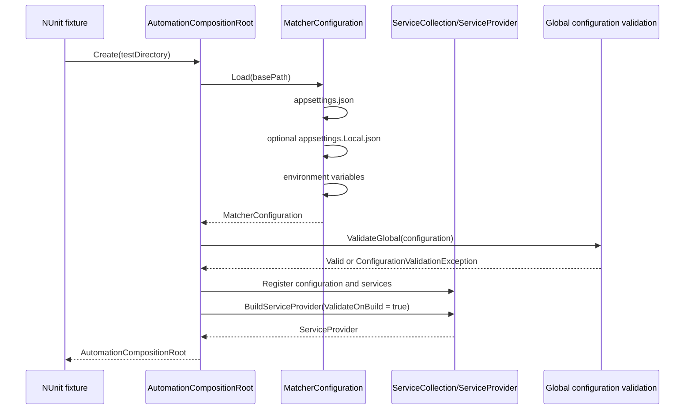
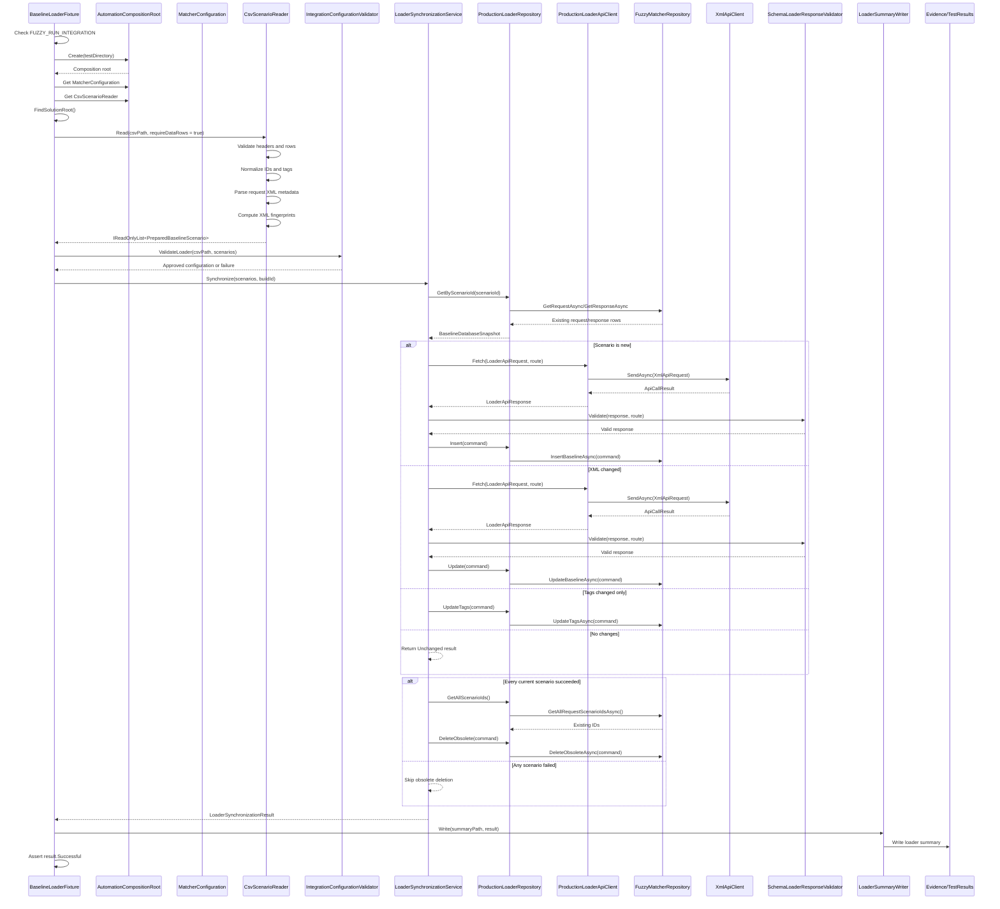
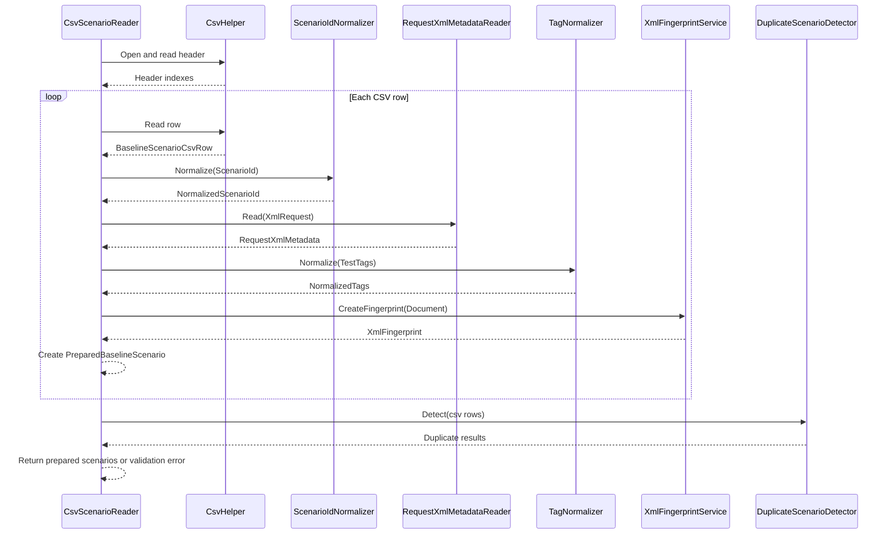
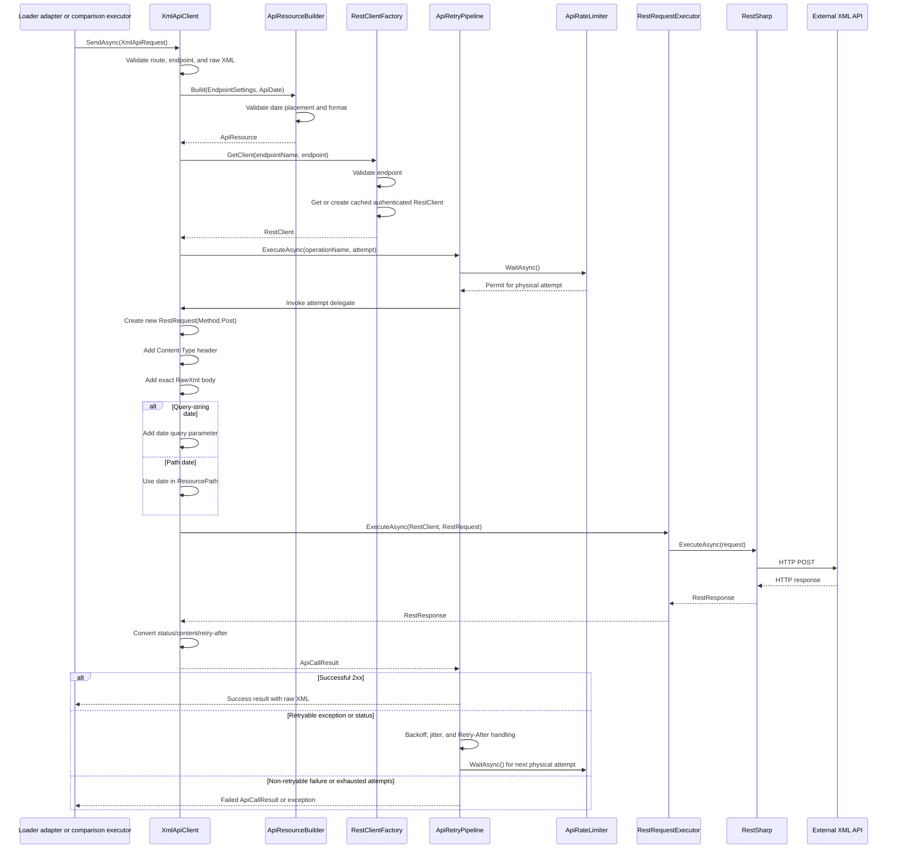
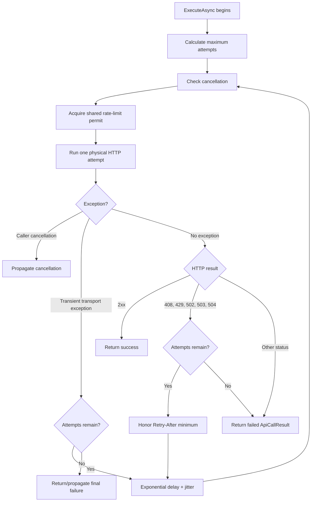
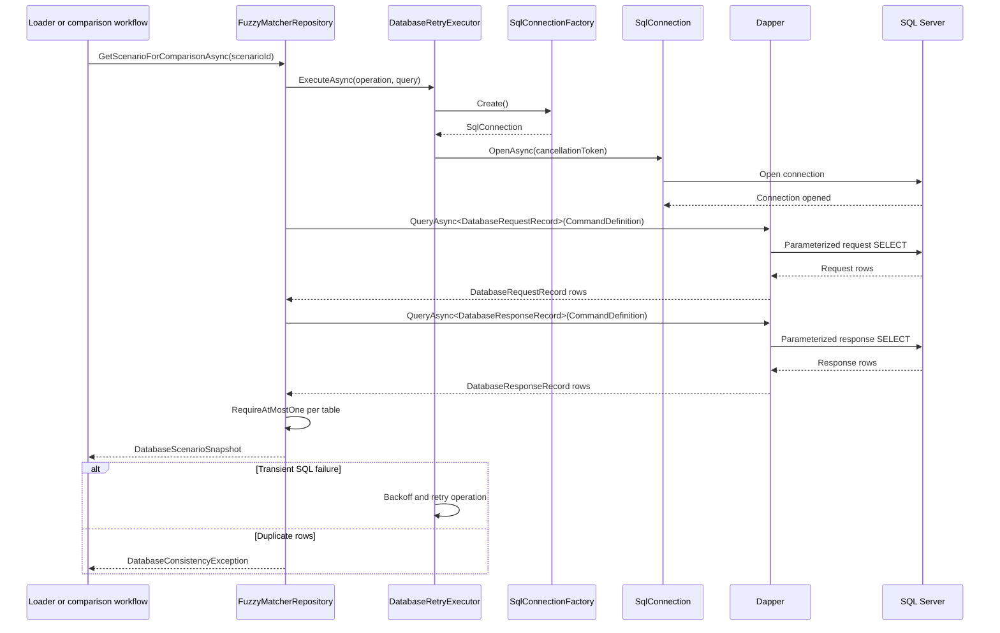
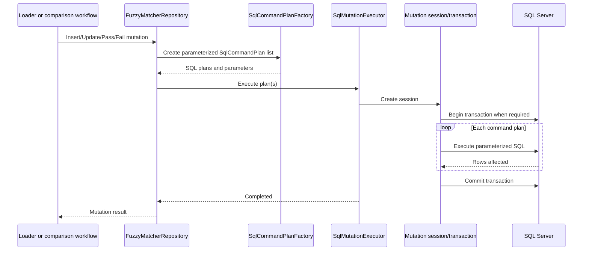
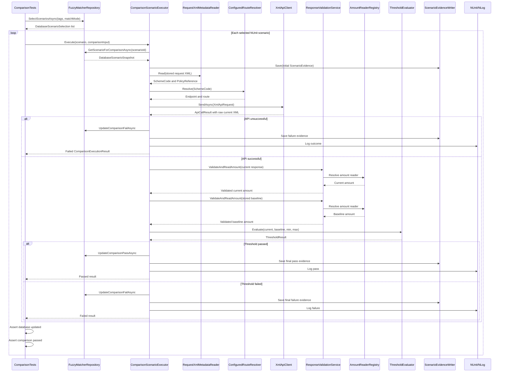

# FuzzyPricingMatcher Sequence Diagrams

## Purpose

This document shows the runtime order of the main workflows. The diagrams reflect the current implementation and are intended to help an architect review control flow, ownership, external boundaries, persistence order, and failure handling.

## Participants

```text
NUnit test fixture
    -> AutomationCompositionRoot
    -> configuration and validation
    -> loader or comparison workflow
    -> processing and routing services
    -> API and SQL infrastructure
    -> XML validation and amount extraction
    -> evidence and reporting
```

## 1. Composition And Service Startup



Live integration tests perform an explicit `FUZZY_RUN_INTEGRATION=true` check before creating or using the live composition root.

## 2. Baseline Loader End-to-End



### Loader safety property

Obsolete deletion is deliberately after all scenario processing. A partial failure prevents cleanup of potentially valid existing baseline data.

## 3. CSV Preparation Detail



## 4. API Request Sequence



The API request does not send `QuoteRef` as a separate header or parameter. The policy reference is sent only if it exists in the raw XML body.

## 5. API Retry Sequence



Every physical attempt, including a retry, passes through the shared rate limiter.

## 6. SQL Read Sequence



Dapper maps SQL aliases such as `Scenario_id AS ScenarioId` to C# properties such as `ScenarioId`. Values are parameters. Configured table identifiers are validated before inclusion in SQL text.

## 7. SQL Mutation Sequence



## 8. Comparison End-to-End



## 9. Evidence Timing

Evidence starts before the API call:

```text
Initial evidence
    -> request XML
    -> stored baseline XML
    -> no API XML yet
    -> Started outcome

API call

Final evidence
    -> request XML
    -> stored baseline XML
    -> API XML when received
    -> final outcome and error
```

This preserves diagnostic material even when the external call fails before returning a response.

## 10. Failure Outcomes

```text
Configuration failure
    -> integration configuration exception
    -> test setup failure

CSV/request validation failure
    -> CSV or request XML validation exception
    -> loader does not proceed with invalid scenario

Database unavailable
    -> database retry policy
    -> DatabaseFailed result when exhausted

Duplicate database rows
    -> DatabaseConsistencyException
    -> comparison or loader failure

API transport failure
    -> ApiTransportException
    -> API retry pipeline
    -> API failure result when exhausted

Retryable HTTP status
    -> 408, 429, 502, 503, or 504
    -> retry with limiter and backoff

Response schema failure
    -> validation failure
    -> comparison/loader failure

Threshold outside range
    -> ThresholdFailed
    -> response table Fail update
    -> NUnit failure
```

## 11. Architect Review Focus

These sequence points are useful review checkpoints:

1. Is scenario selection correctly owned by SQL Server while NUnit remains an execution/reporting engine?
2. Is it safe to retry every configured API `POST`, or should retry safety be route-specific?
3. Should API and SQL workflow calls be fully asynchronous end-to-end?
4. Is the order of response validation, persistence, and evidence capture correct for operational recovery?
5. Should a Pass update replace the stored baseline response, or should current comparison output be stored separately?
6. Are raw XML evidence retention and attachment behavior acceptable for sensitive data?
7. Is the database consistency rule of at most one request and response row sufficient?
8. Should amount extraction be versioned or selected by a stronger schema/route contract?
9. Is the configured API timeout actually applied at the RestSharp boundary?
10. Are integration guards and placeholder checks strong enough for CI and developer workflows?
